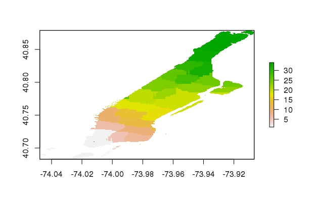

## Task1

The nyc csv file had data with various ways to name the streets, drives, avenues and etc. In order to make things consistent, I turned everything to lower case and then I replaced all addresses to be consistent with the pluto data. This would ensure a maximal join. My joined file consisted of 592336 addresses( latitudes and longtitudes) which should be sufficient to model the precincts. 


## Task2
In order to better our prediction, I realized i had to inpute data for central park. Central Park only consisted of 90 addresses from the Pluto data. Thus it would confound with our prediction. To inpute central park, I first sampled a uniform distribution of 5000 points within a small range of latitude and longitude coordinates that are similar with the size of central park. becuase central park isn't completely aligned with the longitude and latitude lines, I had to tranform the transformed area to fit the precinct.

Then i incorporated an xgboost predictor mainly becuase it was the fastest predictor and got error rates of 10% after 20 iterations. 

The following is the plot of my prediction. 


```{r}

```

